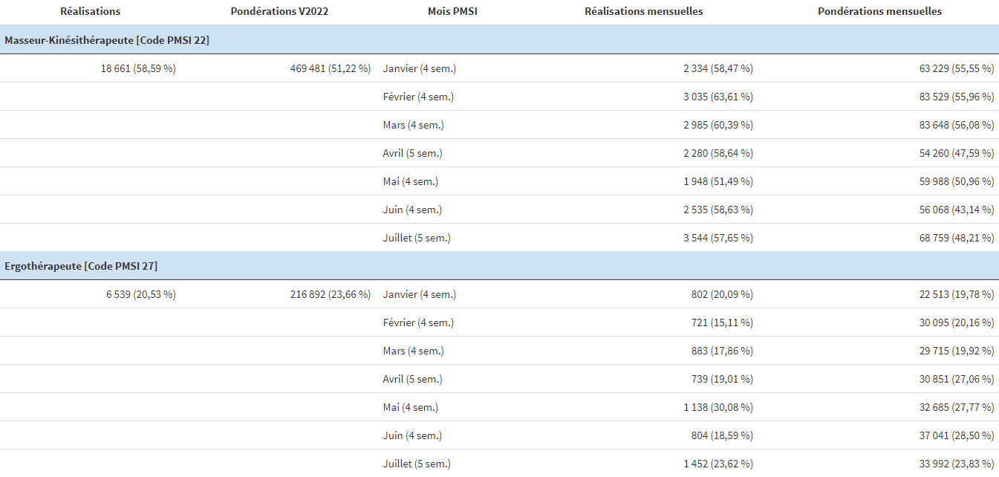
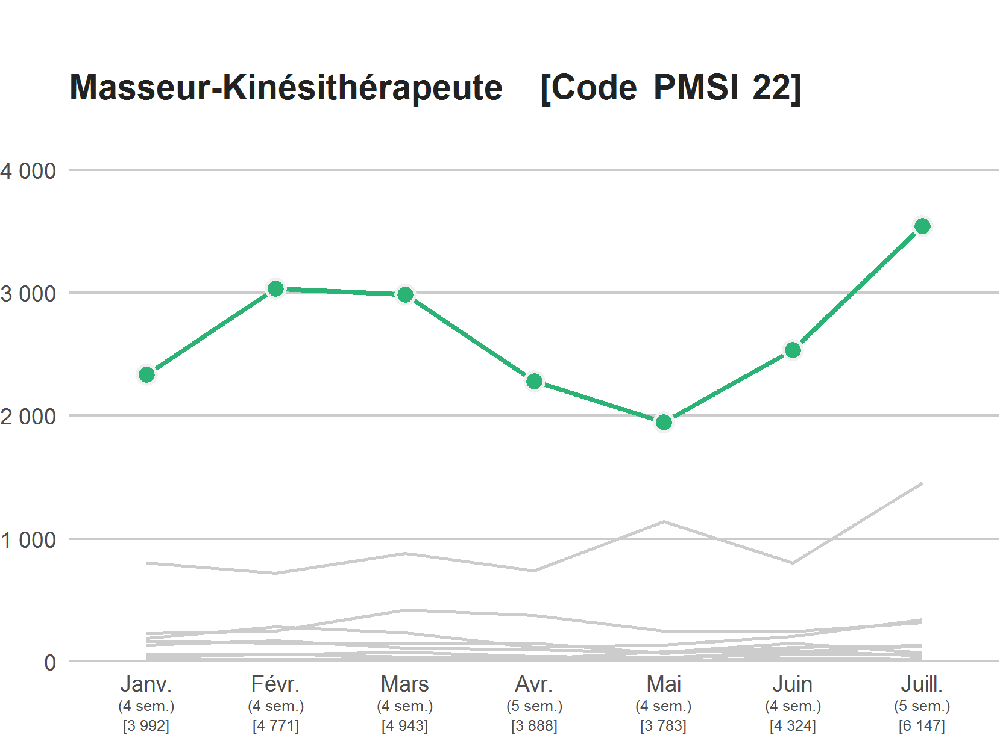
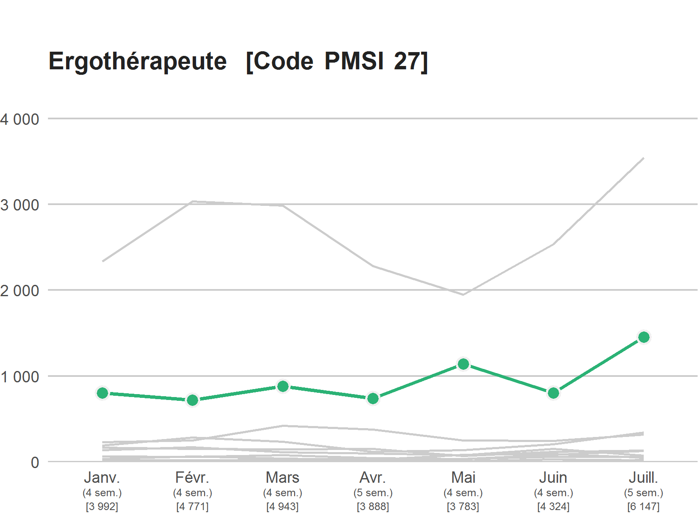
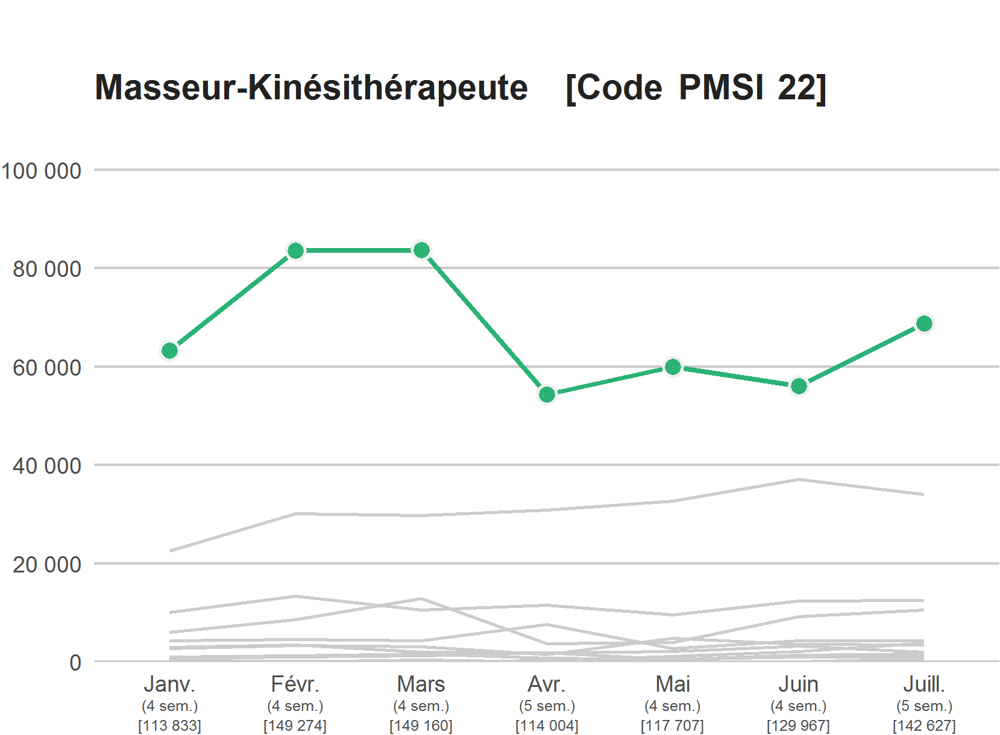
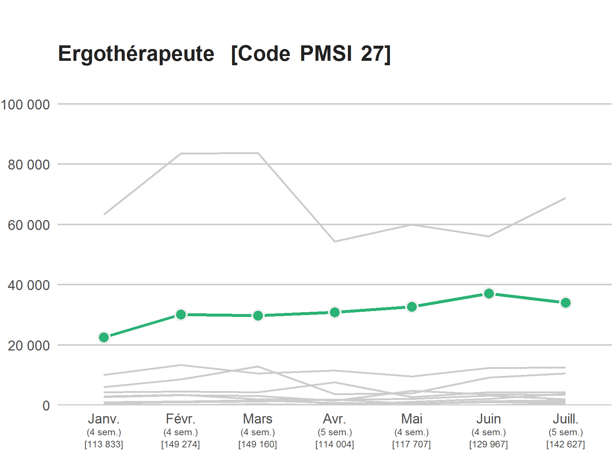

```{r setup, include=FALSE}
knitr::opts_chunk$set(echo = FALSE)
```

# Rappport  

Le rapport est généré automatiquement par PMSISoft en PDF à partir du périmètre de données PMSI défini par les filtres (période, UM, type d'hospitalisation, type d'intervenant).  

> Les pondérations CSARR sont calculées à partir du [référentiel des pondérations CSARR V2022](https://www.atih.sante.fr/experimentation-nouvelle-classification-ssr-2022-0), quelle que soit la période sélectionnée.

## Tableau  

<center>
<figure>
  
  <figcaption>Case-mix filtré sur 7 mois et 2 intervenants</figcaption>
</figure>
</center>

Le tableau affiche pour chaque type d'intervenant sélectionné 5 calculs ou informations.

**Réalisations** = total des réalisations CSARR de l'intervenant dans le périmètre + pourcentage que représente ce total par rapport à l'ensemble des réalisations CSARR du périmètre.  

**Pondérations V2022** = total des pondérations CSARR de l'intervenant dans le périmètre + pourcentage que représente ce total par rapport à l'ensemble des pondérations CSARR du périmètre.  

**Mois PMSI** = liste des mois PMSI SSR du périmètre avec indication du nombre de semaines civiles incluses dans le mois PMSI SSR.  

**Réalisations mensuelles** = pour chaque mois PMSI SSR sélectionné, total des réalisations CSARR de l'intervenant + pourcentage que représente ce total par rapport à l'ensemble des réalisations CSARR du périmètre pour ce mois PMSI SSR.   

**Pondérations mensuelles** = pour chaque mois PMSI SSR sélectionné, total des pondérations CSARR de l'intervenant + pourcentage que représente ce total par rapport à l'ensemble des pondérations CSARR du périmètre pour ce mois PMSI SSR.   

Les intervenants sont affichés par ordre décroissant sur la colonne **Réalisations**  

## Graphiques  

### Graphique "Réalisations CSARR par intervenant"  

<center>
<figure>
  
  <figcaption>Evolution mensuelle des réalisations CSARR pour un intervenant</figcaption>
</figure>
</center>

<center>
<figure>
  
  <figcaption>Evolution mensuelle des réalisations CSARR pour un autre intervenant</figcaption>
</figure>
</center>

Un graphique par type d'intervenant sélectionné.  

**Axe x** = suite des mois PMSI SSR du périmètre, affichés en abrégé + le nombre mensuel de semaines civiles, entre () + le total mensuel de réalisations CSARR de tous les intervenants du périmètre, entre []  

**Axe y** = gradations en nombre de réalisations CSARR, calées sur le maximum mensuel du nombre de réalisations CSARR  

L'évolution mensuelle du nombre de réalisations CSARR de l'intervenant du graphique est marquée en vert. Les évolutions mensuelles du nombre de réalisations CSARR des autres intervenants du périmètre sont affichées en gris clair à fin de comparaison.    

Les graphiques d'intervenants sont affichés par ordre décroissant sur le nombre de réalisations CSARR des intervenants.  

### Graphique "Pondérations CSARR par intervenant"  

<center>
<figure>
  
  <figcaption>Evolution mensuelle des pondérations CSARR pour un intervenant</figcaption>
</figure>
</center>

<center>
<figure>
  
  <figcaption>Evolution mensuelle des pondérations CSARR pour un autre intervenant</figcaption>
</figure>
</center>

Un graphique par type d'intervenant sélectionné.  

**Axe x** = suite des mois PMSI SSR du périmètre, affichés en abrégé + le nombre mensuel de semaines civiles, entre () + le total mensuel des pondérations CSARR de tous les intervenants du périmètre, entre []

**Axe y** = gradations en pondération CSARR, calées sur le maximum mensuel des pondérations CSARR  

L'évolution mensuelle des pondérations CSARR de l'intervenant du graphique est marquée en vert. Les évolutions mensuelles des pondérations CSARR des autres intervenants du périmètre sont affichées en gris clair à fin de comparaison.  

Les graphiques d'intervenants sont affichés par ordre décroissant sur le total des pondérations CSARR des intervenants.  

# Méthodologie  

Périmètre = l'ensemble des actes CSARR rattachés au(x) type(s) d'intervenant sélectionné(s) des RHS correspondant aux UM, type d'hospitalisation et mois PMSI sélectionnés.  

Pour l'hospitalisation complète, seuls les RHS de l'année sélectionnée sont retenus.  

Les actes CSARR supprimés à partir de l'année PMSI SSR 2021 (commencé semaine 9 de 2021) ont été transcodés en actes CSARR 2021 conformément aux recommandations ATIH, avant tout calcul.  

Le type intervenant 29 "(Neuro)psychorééducateur", supprimé à partir de l'année PMSI SSR 2021, a été systématiquement recodé 33 "Neuropsychologue"

Pondération CSARR d'un acte = pondération CSARR unitaire V2022 de l'acte, tenant compte des règles de calcul des pondérations V2022 (pondération nulle pour certains couples acte x intervenant, majoration modulateur associé HW, LJ, HW, étape appareillage C) x nombre de réalisations de l'acte  

# Notes - Caveat  

Un mois PMSI SSR correspond à un ensemble de 4 ou 5 semaines civiles. Pour un mois donné, ces ensembles sont variables d'une année à l'autre, rendant les comparaisons d'activité inter-annuelles délicates.  

Intervenant = type d'intervenant par abus de langage.    

Dans les graphiques, la gradation des ordonnées (axe y) est réalisée automatiquement via l'algorithme d'Heckbert.  

Les images des tableaux et graphiques de ce post ont été produits à partir d'un mini jeu de données généré par nos soins.  

```{js, echo=FALSE}  
(function() {  
  for (const link of document.getElementsByTagName('a')) {  
    if (/^(https?:)?\/\//.test(link.getAttribute('href'))) link.target = '_blank';  
  }  
})();  
```  